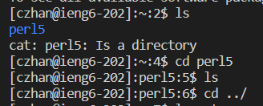
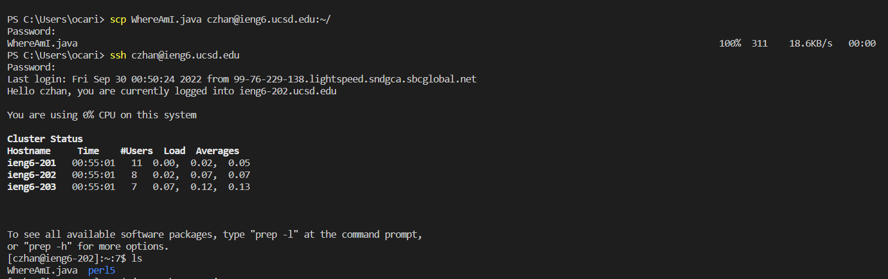
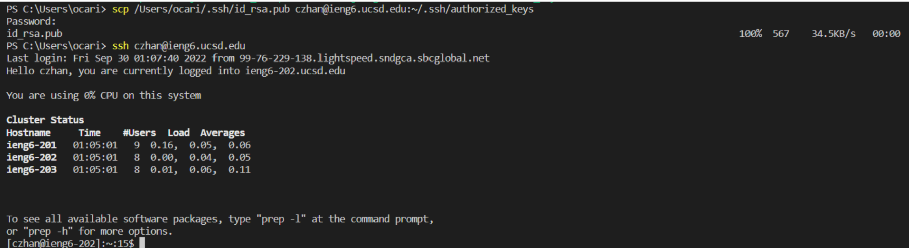
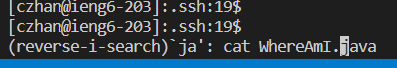

 # Tutorial: Remote Access

## Installing VSCode
- Download VSCode [here](https://code.visualstudio.com/)
- Follow the directions on the installer
- I did not install it fresh because I already have it 
- Once you have it installed, it should look like this:
- 
  - Go to Settings > Optional Features
  - Install OpenSSH Client
  - I did not complete this step because I already had OpenSSH
- In VSCode, open Terminal
  - Look at the top for the terminal option -> New Terminal
- Type in `ssh cs15lfa22qt@ieng6.ucsd.edu`
  - I did not complete this step because my password wouldn't change; instead, I used my AD username
  - Enter your password 
  - Type yes in response to continuing to connect
- Now, once you're in the server, it should look like this:
- 

## Trying Some Commands
- Try some common commands
- `cd ~`
  - Moves you into your home directory
- `ls`
  - Shows what's in the current directory
- `cp`
  - Copies a file into a chosen directory
- 
  
## Moving Files with scp
- To move files across computers, such as from your computer to the UCSD server, use the `scp` command
- Navigate to the directory with the file you want to
- Run `scp WhereAmI.java czhan@ieng6.ucsd.edu:~/`
  - This copies the WhereAmI.java file from your computer into the server's home directory (denoted by ~)
  - If you ssh into your server, you'll see the file there (run ls in your home directory to check)
- 
## Setting an SSH Key
- When using ssh, you have to type your password in every time
- Using an SSH lets the server recognize your computer as safe to log in with, meaning you don't need to log in with a password
- To add these ssh keys, we use a ssh key generator 
- Run `ssh-keygen` on your home computer to create the public and private keys that confirm your identity
- When prompted find which directory to add your keys in, just press enter for the default one (your user home)
- On Windows, use ssh-agent to securely store your keys 
  - Run Powershell as administrator
  - Run `Get-Service ssh-agent | Set-Service -StartupType Automatic`
    - ssh-agent is usually disabled; this enables it
  - Run `Get-Service ssh-agent`
    - This checks if you successfully enabled ssh-agent and will show if it is Running or not 
  - Run `ssh-add $env:USERPROFILE\.ssh\id_rsa`
    - This loads the keys into ssh-agent
- Now we have the keys on our computer, we need to move the public key into the server
  - Go to the server and run `mkdir .ssh`, then log out
    - This creates the .ssh folder in the server's home directory so we can place the keys in it 
  - Now, copy the public key over with `scp /Users/ocari/.ssh/id_rsa.pub czhan@ieng6.ucsd.edu:~/.ssh/authorized_keys
    - This saves the public key into a folder called .ssh and renames the public key file name to be authorized_keys
  - Now, we can log in without using a password
  - 

## Optimizing Remote Running
- Some ways to go faster:
  - Pressing the up key lets you grab commands from before
  - You can use ; to chain together commands
  - You can use Ctrl + R to search for your previous commands
    - 
