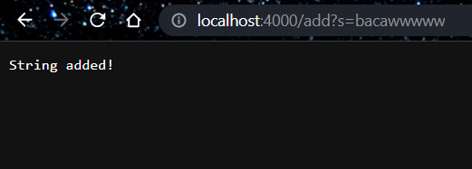
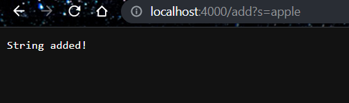
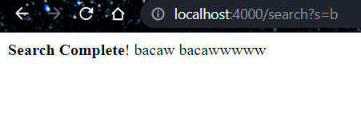

 # Tutorial: Search Engine

## Code for search engine:
```
class Handler implements URLHandler 
{
    // The one bit of state on the server: a number that will be manipulated by
    // various requests.

    ArrayList<String> queries = new ArrayList<String>();

    public String handleRequest(URI url) {
        if (url.getPath().equals("/")) {
            return String.format("Hello! This server tracks and adds strings!");
        } 
        else 
        {
            System.out.println("Path: " + url.getPath());
            if (url.getPath().contains("/add")) 
            {
                String[] parameters = url.getQuery().split("=");
                if (parameters[0].equals("s")) 
                {
                    queries.add(parameters[1]);
                    System.out.println("queries: " + queries);
                    return String.format("String added!");
                }
            }
            else if (url.getPath().contains("/search"))
            {
                String[] searchParameters = url.getQuery().split("=");
                if (searchParameters[0].equals("s")) 
                { 
                    if (searchParameters.length < 2)
                    {
                        return String.format("<b>Search Complete</b>! \n%s", queries);
                    }

                    String searchQueries = "";
                    for (String i : queries)
                    {
                        if(i.contains(searchParameters[1]))
                        {
                            searchQueries += i + "\n";
                        }
                    }
                    return String.format("<b>Search Complete</b>! \n%s", searchQueries);
                }
            }

        return "404 Not Found!";
        }
    }
}

class SearchEngine 
{
    public static void main(String[] args) throws IOException 
    {
        if(args.length == 0)
        {
            System.out.println("Missing port number! Try any number between 1024 to 49151");
            return;
        }

        int port = Integer.parseInt(args[0]);

        Server.start(port, new Handler());
    }
}

```

### Starting page:


This calls an if statement that returns the string "Hello! This server tracks and adds strings!"

### Adding page:




This calls a statement that checks if the path contains /add and has ?s=[query], which it does. So, it adds the query to an Arraylist that contains all the queries. Here, we add "bacaw", "bacawwwww", and "apple". So, the array list now has ["bacaw", "bacawwwww", "apple"]. 

### Searching through Queries:



This calls a statement that checks if the path contains /search and has ?s=[search]. In this case, it searches through the list of queries for anything that contains the letter b. Here, it returns bacaw and bacawwwwww because those are the only things we inputted with the letter b in it. 


 # Tutorial: Debugging

 ## Array Tests
  For the averageWithoutLowest function in the Array Examples file, there was a bug!
  ### Test:
```
double[] input3 = {1, 1, 2, 2, 3}; 
assertEquals(2,ArrayExamples.averageWithoutLowest(input3),0.001);
```
Here, we try to get the average of 1, 1, 2, 2, 3 without the lowest number (1).
  ### Symptom:
  We expect the answer to be 2 (average of 1, 2, 2, 3 is 2), but instead we get 1.75. \
  JUnit tells us: 
  ```
  JUnit version 4.13.2
.E.[4, 3, 2, 1]
.
Time: 0.012
There was 1 failure:
1) testAverageWithoutLowest(ArrayTests)
java.lang.AssertionError: expected:<2.0> but was:<1.75>
```
Looking at the code, we see that we get rid of the duplicate from being averaged in by checking if a number is the same as lowest:

```
for(double num: arr) {
      if(num != lowest) { sum += num; }
    }
```
However, the problem with this approach is that we remove *all* numbers that are the same as lowest, not just the first one. In our test, the code got rid of all the 1s, not just the first one. 

### Fix: 
To fix this, we can just subtract the first instance of the lowest number from the sum, then take the average from there. 
```
 for(double num: arr) {
      sum += num;
    }
    sum = sum - lowest;
    return sum / (arr.length - 1);
```

## List Tests

For the merge function in the List Examples file, there was a bug!

### Test:
```
List<String> input1 = Arrays.asList("a", "c", "e");
List<String> input2 = Arrays.asList("b", "d", "f");
List<String> correct = Arrays.asList("a", "b", "c", "d", "e", "f");

assertEquals(correct, ListExamples.merge(input1, input2));
```
This test creates two arrays (`input1` and `input2`) and tries to merge them to get the same result as `correct`. 

### Symptom:
We expect the answer to be a, b, c, d, e, f, but it gets stuck in an infinite loop. \
JUnit tells us: 
```
java.lang.OutOfMemoryError: Java heap space
```
In the code, we see that it stops the while loop when index2 is greater than list2. 
```
while(index2 < list2.size()) {
  result.add(list2.get(index2));
  index1 += 1;
}
```
But, if we look at how they actually get added to, we see that only index1 is getting interated! \
So, index2 will never become bigger than its list counterpart, meaning the code gets stuck in the loop for forever. 

### Fix: 
To fix this, we simply need to start iterating index2 instead of index1, meaning we can exit the while loop. 
```
while(index2 < list2.size()) {
    result.add(list2.get(index2));
    index2 += 1;
}
```
