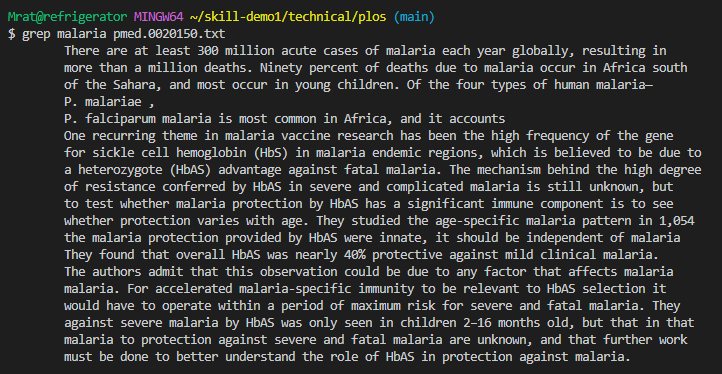

# Researching the Grep Command

The main purpose of the `grep` command is to search text inside a file or multiple files. This is different from `find` in that find is mostly used to look through file names themselves. 

## A basic use of grep: 


This looks through pmed.0020150.txt for the lines where "malaria" shows up. 

## Useful Command Line Options

### grep -r 

Grep -r lets you grep recursively through a directory for any instances of the string you are looking for. This means you can search through a whole directory instead of a file. 

For example, starting in technical/ and going to plos/, we can search through all of the plos folder for any mention of word vaccine. We don't need to specify any folder or file because it just takes our current working directory as the directory to search through. 
```
$ cd plos
$ grep -r vaccine
journal.pbio.0020068.txt: at vaccine development. The same insects that transmit these devastating human parasites

journal.pbio.0020145.txt: for vaccines based on the timing of gene transcription. In order to answer this question,

journal.pbio.0020394.txt: verbs, which are rife. This does tend to offer a vaccine against Hawkins' otherwise     

journal.pbio.0030097.txt: Africa reporting some exciting progress toward the development of a vaccine for malaria.

pmed.0010010.txt: epidemic was going to go, absent an effective vaccine or cure, but few of us could have

pmed.0010026.txt: and vaccines. Short synthetic peptides are ideal for drug development because of the

pmed.0010026.txt: vaccines. Now, however, a long list of more or less tumor-specific antigens has been

pmed.0010026.txt: authors propose that the cause for the decreased affinity of vaccine-elicited CTLs could be 

[truncated for length]
```

Another example of using the -r flag is by specifying a folder. If we start in technical/ but want to search through the government/Alcohol_Problems/ folder for the word discussion without actually going to the folder, we can specify that folder while searching with grep -r. One difference between this and the previous example of searching through the current working directory is how it displays the results. This example will show the file name with the path starting from our current working directory (technical/), so it says government/Alcohol_Problems/DraftRecom-PDF.txt. Previously, it only showed the file name because we were already in that directory. 

```
$ grep -r discussion government/Alcohol_Problems/
government/Alcohol_Problems/DraftRecom-PDF.txt: to attendees for general discussion.

government/Alcohol_Problems/DraftRecom-PDF.txt: discussion.

government/Alcohol_Problems/DraftRecom-PDF.txt: but rewritten to reflect the discussion.

government/Alcohol_Problems/Session3-PDF.txt: assumptions had arisen during discussions at the conference. The

government/Alcohol_Problems/Session4-PDF.txt: discussion should greatly assist the articulation of a focused,

government/Alcohol_Problems/Session4-PDF.txt: discussions over the past two days is that of policy research. This
```

With grep -r, the examples we've seen all search through folders with only text files, not folders that also contain folders. However, grep will also work with folders within folders. The government/ folder contains   `About_LSC/, Alcohol_Problems/, Env_Prot_Agen/, Gen_Account_Office/, Media/, and Post_Rate_Comm/`. 

If we try running grep -r on the govenrment folder to search for the word meeting, grep -r will still work and search through each one of those folders. Here, we can see it has looked through all the folders in government and found results from About_LSC, Alcohol_Problems, Env_Prot_Agen, and Gen_Account_Offuce. 

```
$ cd government/
$ grep -r meeting
About_LSC/Comments_on_semiannual.txt: TIGs. In October 2000 and March 2001, LSC hosted meetings of TIG

About_LSC/Comments_on_semiannual.txt: State Planning Initiative and resulting mergers. At the meeting,

About_LSC/conference_highlights.txt: www.legalmeetings.org. 3) Mr. Genz announced the deadlines for this

About_LSC/ONTARIO_LEGAL_AID_SERIES.txt: program visits. At LSC Board meetings, local events and national

Alcohol_Problems/Session4-PDF.txt: sessions at the annual meeting. To date, SAEM has not agreed to a

Env_Prot_Agen/1-3_meth_901.txt: Mount at the 1983 annual meeting of the Society for Environmental

Env_Prot_Agen/atx1-6.txt:least annually or whenever difficulty is encountered in meeting

Gen_Account_Office/Sept14-2002_d011070.txt: enhanced flexibility in meeting job demands. For example, VBA

[truncated for length] 
```

### grep -n

Grep -n lets us see the line number alongside the results. If you look in our basic case, it just showed each line that had the word malaria in it. But what if we want to know what line the word appeared in? 

Let's try looking in Env_Prot_Agen/1-3_meth_901.txt for the word water and see which lines it appears in. It is the number before the colon in each of the results, such as 13, 69, and 83. 

```
$ cd government/Env_Prot_Agen
$ grep -n  water 1-3_meth_901.txt
13: other aquatic life in the receiving waters. The endpoints that have

69: establish water quality criteria.

83: days post-hatch for warm water fish with embryogenic periods

99: data could be used in establishing water quality criteria if data

171: using dilution water from Lake Superior. The results

211: freshwater organisms, fathead minnows, Pimphales promelas, and

225: wastewaters using the two-day red macroalga, Champia parvula,

239: waters than was provided by acute toxicity tests, at an only

276: concentration (e.g., the receiving water concentration or RWC) and

295: Receiving (ambient) water toxicity tests commonly employ

296: two treatments, a control and the undiluted receiving water, but

297: may also consist of a series of receiving water
```

What if we try it on multiple files? 
We can see that it first shows the name of the file and then the line number, with colons between as separaters. 

```
$ grep -n  water *.txt
1-3_meth_901.txt:13: other aquatic life in the receiving waters. The endpoints that have

1-3_meth_901.txt:69: establish water quality criteria.
...
atx1-6.txt:6: Receiving Waters to Freshwater and Marine Organisms

atx1-6.txt:31: Program to identify effluents and receiving waters containing toxic
```

We can also try the -r flag with a different directory to see if it continues the trend of showing the file path from our current working directory alongside the line number. And it does! We can see we've grabbed from a range of folders, like biomed, government, and plos, and each file has the line number of the line containing the word mercury. 

```
$ pwd
/Users/[]/skill-demo1/technical
$ grep -r -n mercury
biomed/1471-2180-3-4.txt:257: soil cover. The UV light, provided by a mercury vapor lamp,

biomed/1471-2180-3-4.txt:653: approximately 50 cm from the 15-watt mercury vapor light

biomed/1472-6793-2-1.txt:447: calibrated by mercury manometer at the beginning of

government/Env_Prot_Agen/tech_adden.txt:2310: mercury to a much wider range of other environmental and ecological

government/Env_Prot_Agen/tech_sectiong.txt:25: dioxide (CO2), and mercury (Hg) from the electric power

plos/pmed.0020061.txt:8: methyl mercury, polychlorinated biphenyls (PCBs), and tobacco [1,2,3,4,5] (Box 1). Over the
```

### grep -A and grep -B 

The grep -A and grep -B flags are used to change what output results and do very similar things.

grep -A will show you x number of lines **a**fter the found result, while -B will show you x number of lines **b**efore it. You can specify x by typing it after the A and B. 

Let's look at the normal behavior if we search the word sphygmomanometer inside plos/pmed.0020162.txt
```
$ cd plos/
$ grep sphygmomanometer pmed.0020162.txt
          mercury sphygmomanometer was used to take two measures each of systolic and diastolic
```

But what if I want to look at the context for this phrase? I'll use the -A and -B flag to look two lines before and after this phrase about the sphygmomanometer. 

```
$ grep -A2 -B2 sphygmomanometer  pmed.0020162.txt
          nearest 0.5 cm, and the averages of two measures (different by no more than 1 cm) were used to calculate the waist-to-hip ratio (WHR). After participants rested for 5 min, a mercury sphygmomanometer was used to take two measures each of systolic and diastolic blood pressure (seated, right arm); averages of these two measures were used for data analysis. High blood pressure was defined as systolic blood pressure 140 mm Hg or higher,
```


