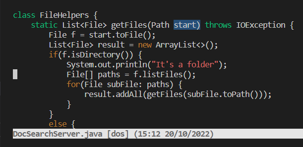

# Optimizing Vim

DocSearchServer.java: Original state

To change the name of the start parameter and its uses to base: 
(17 keystrokes)

`:%s/start/base/g` \
`<Enter>`

At the bottom, it says “4 substitutions on 4 lines” to show how many substitutions it made

# Part 2

Once, start in Visual Studio Code and make the edit there, then scp the file to the remote server and run it there to confirm it works (you can just run bash test.sh on the remote to test it out). Consider having the appropriate scp command in your command history or easily copy-pasteable!

48 seconds

Second, start already logged into a ssh session. Then, make the edit for the task you chose in Vim, then exit Vim and run bash test.sh.

30 seconds 

Difficulties: had to still log into the remote after scp, which took longer 

I'd rather go with the second option of making the change remotely because it is faster and ensures that whatever I do will work on the computer. If I move something over from my computer, I want to make sure it doesn't stop working for some reason on a different OS. 

Some factors in my decision would be looking at if I need any special applications and if one machine has it, but not the other. It could also be OS dependent; for instance, one thing might work in bash but not powershell, and it could be easier to develop for Linux in a linux machine. 