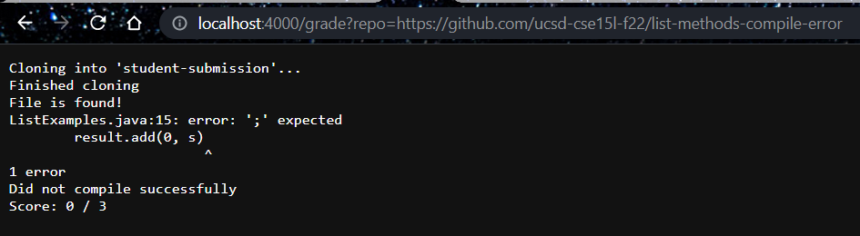
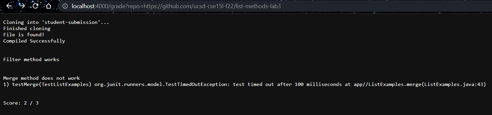

# Lab Report 5

## Grade.sh: 
```
set -e

rm -rf student-submission
git clone $1 student-submission
echo 'Finished cloning'

cp TestListExamples.java student-submission/

cd student-submission
rm -rf .git
# points for: compiling successfully, filter working, and merge working

score=0
total=3

if [ -f "ListExamples.java" ]
then
    echo "File is found!"
else
    echo "File isn't found, submit a file titled ListExamples.java"
    echo "Score: $score / $total"
    exit
fi

set +e

javac -cp ".;../lib/hamcrest-core-1.3.jar;../lib/junit-4.13.2.jar" *.java

if [ $? -eq 0 ]
then
    echo  "Compiled Successfully"
    ((score=$score+1))
    echo -e "\n"
else   
    echo "Did not compile successfully"
    echo "Score: $score / $total"
    exit
fi

java -cp ".;../lib/junit-4.13.2.jar;../lib/hamcrest-core-1.3.jar" org.junit.runner.JUnitCore TestListExamples > errors.txt

filterResult=$(grep -A2 "testFilter(TestListExamples)" errors.txt)

if [ -n "$filterResult" ]
then
    echo "Filter method does not work"
    echo $filterResult
    echo -e "\n"
else   
    echo "Filter method works"
    ((score=$score+1))
    echo -e "\n"
fi

mergeResult=$(grep -A2 "testMerge(TestListExamples)" errors.txt)

if [ -n "$mergeResult" ]
then
    echo "Merge method does not work"
    echo $mergeResult
    echo -e "\n"
    echo "Score: $score / $total"
else   
    echo "Merge method works"
    ((score=$score+1))
    echo -e "\n"
    echo "Score: $score / $total"
fi
```

## Some Examples of Usage





## Tracing the Script

### When grading at the file with a correct implementation, we can trace the code to see how each line works. 

```
set -e
```
This tells bash to terminate the script if something has a non zero status (aka if a command doesn't execute correctly)

```
rm -rf student-submission
```
This deletes any previous student submissions we've graded so git doesn't error out about how there's already a repo with x name. 
```
git clone $1 student-submission
```
This clones the repo into your directory; you tell bash which repo to clone by giving the link as an argument (which is saved as $1). In this case, we are grading https://github.com/ucsd-cse15l-f22/list-methods-corrected. 
The standard output is: 
```
Cloning into 'student-submission'...
remote: Enumerating objects: 3, done.
remote: Counting objects: 100% (3/3), done.
remote: Compressing objects: 100% (2/2), done.
remote: Total 3 (delta 0), reused 3 (delta 0), pack-reused 0
Receiving objects: 100% (3/3), done.
```
It also has a return code of 0 because it was successful. 

```
echo 'Finished cloning'
```
Tells you the repo has finished cloning; if this command fails (such as due to a wrong link), this won't echo and the script will terminate due to the set -e. 

```
cp TestListExamples.java student-submission/
cd student-submission
```
Copies our test file that we need to test the student's code into the repo and goes into that repo. 

```
rm -rf .git
```
Not grading related, just there so I can push the files to my repo without github turning it into a submodule.

```
score=0
total=3
```
sets up the score variables

```
if [ -f "ListExamples.java" ]
then
    echo "File is found!"
else
    echo "File isn't found, submit a file titled ListExamples.java"
    echo "Score: $score / $total"
    exit
fi
```
This checks if ListExamples.java is a file. In this case, it is true because this is a file that got submitted. We print that the file was found to indicate this.  
Everything in the else statement is not run because the then part was true. 

```
set +e
```
Here, we turn set -e off because we don't want the script to terminate if there's an error, we just want to alert the user to it (and future errors).

```
javac -cp ".;../lib/hamcrest-core-1.3.jar;../lib/junit-4.13.2.jar" *.java
```
This compiles all the java files in our folder. It doesn't have any standard output when successful. 

```
if [ $? -eq 0 ]
then
    echo "Compiled Successfully"
    ((score=$score+1))
    echo -e "\n"
else   
    echo "Did not compile successfully"
    echo "Score: $score / $total"
    exit
fi
```
This checks if the exit code of the previous command (javac) was successful or not. If it is equal to 0, meaning successful, we will tell the user that it compiled successfully, add 1 to their score, and print a newline for readability. We do not run the else part, which will tell you it did not compile successfully and print your score out (0), then terminate the script. 

```
java -cp ".;../lib/junit-4.13.2.jar;../lib/hamcrest-core-1.3.jar" org.junit.runner.JUnitCore TestListExamples > errors.txt
```
Here, we run the test file and put the std output into errors.txt. This shows all the tests passed, with an exit code of 0.  
output: 
```
JUnit version 4.13.2
..
Time: 0.021

OK (2 tests)
```
```
filterResult=$(grep -A2 "testFilter(TestListExamples)" errors.txt)
```
We search through the JUnit output for testFilter(TestListExamples); if this method had an error, grep will return that line. -A2 grabs the next two lines after the place it appeared so we can print it for the user and give them more information about their error. 
```
if [ -n "$filterResult" ]
then
    echo "Filter method does not work"
    echo $filterResult
    echo -e "\n"
else   
    echo "Filter method works"
    ((score=$score+1))
    echo -e "\n"
fi
```
This checks if filterResult is an empty string or not. If it's not empty, that means grep found that filter had an error. However, it is empty here, meaning the else statement (and not the then statement) will execute. We print that the filter method works, add another point for the user's score, and print a newline for readability. 
```
mergeResult=$(grep -A2 "testMerge(TestListExamples)" errors.txt)
```
Same thing here but with the merge method, checking if testMerge had an error or not. 

```
if [ -n "$mergeResult" ]
then
    echo "Merge method does not work"
    echo $mergeResult

else   
    echo "Merge method works"
    ((score=$score+1))
fi
```
We check if mergeResult is empty or not; if it is empty, then we print that the merge method works and add another point to their score. The then statement doesn't run. 

```
echo -e "\n"
echo "Score: $score / $total"
```
Print newline for readability, then print out the user's score. Here, we print out 3/3 because all the methods passed and they got full points. 